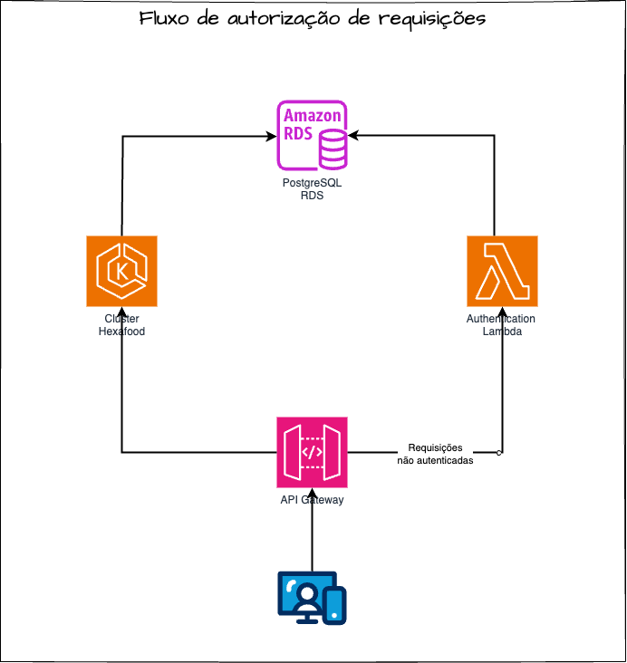

# HexaLambdaAuthorization

## :boat: Sobre o projeto
O propósito deste projeto é facilitar a autenticação de usuários na nossa aplicação. Trata-se de uma aplicação enxuta, cuja responsabilidade principal é autenticar o usuário por CPF ou de forma anônima.

Uma vez autenticado, um token é gerado para o cliente, permitindo que ele faça pedidos na aplicação de forma segura e identificada.

## :chart_with_upwards_trend: Fluxo de requisições

O objetivo desta função lambda é gerar um token de autenticação para requisições serem aprovadas pelo API Gateway. Neste projeto, foi definido que todas requisições que se comunicaracão com a API no cluster, devem estar com token de autenticação, mesmo que sejam de usuários que não se identificaram. 

A imagem a seguir, resume o fluxo de autorização de requisições pelo API Gateway:

 
<h4 align="center">
    
</h4>
 

## :bookmark_tabs: Licença

Este projeto esta sobe a licença MIT. Veja a [LICENÇA](https://opensource.org/licenses/MIT) para saber mais.

## :wink: Autores

Feito com ❤️ por:

- [Bruno Padilha](https://www.linkedin.com/in/brpadilha/)
- [Lucas Siqueira](https://www.linkedin.com/in/lucassouzatidev/)
- [Marayza Gonzaga](https://www.linkedin.com/in/marayza-gonzaga-7766251b1/)

[Voltar ao topo](#índice)

